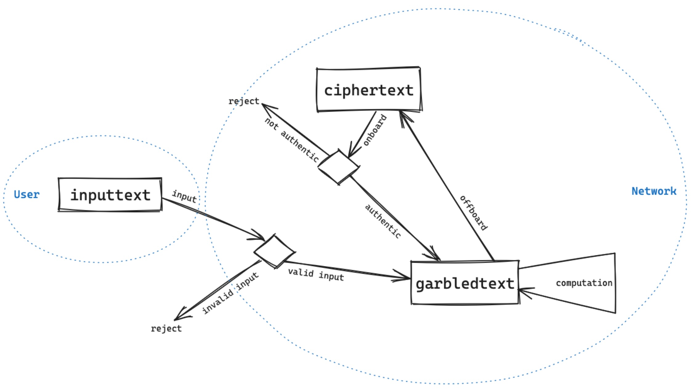

# Private Data Types

The gcEVM extends the capabilities of the EVM across various dimensions. Initially, it introduces novel data types to accommodate the necessity of maintaining privacy. Subsequently, it introduces additional operations capable of manipulating these private data types without compromising their secrecy.

## Data Types

To support privacy, we introduce a new set of data types mirroring the existing solidity types with size of up to 64 bits.\
We present four new types needed for manipulating private smart contracts:

* Ciphertext (ctBool, ctUint8, ctUint16, ctUint32, ctUint64, ctString)
* Usertext (utBool, utUint8, utUint16, utUint32, utUint64, utString)
* Inputtext (itBool, itUint8, itUint16, itUint32, itUint64, itString)
* Garbledtext™ (gtBool, gtUint8, gtUint16, gtUint32, gtUint64, gtString)

We make a distinction between private data types that are used for encrypting the values of transaction inputs, variables stored in storage slots and variables stored in memory. That is, while the Ciphertext and Usertext data types (denoted CT and UT respectively) are used to secure data in storage, we use the Inputtext data type (denoted IT) for protecting data in transaction inputs and the Garbledtext™ data type (denoted GT) for protecting data in use.


Detailed examples of these types and converting between them are found in the [**coti-contracts-examples**](https://github.com/coti-io/coti-contracts-examples) repository.


**Usage**

* **Ciphertext** is one of two types utilized for storing encrypted data in contract storage. Note that a Ciphertext can be encrypted either with an EOA's AES key or the network key.
* **Usertext** is another type utilized for storing encrypted data in contract storage. It is comprised of two parts:
  * ciphertext: a value of type Ciphertext that is encrypted with the network key
  * userCiphertext: a value of type Ciphertext that is encrypted with an EOA's AES key
* **Inputtext** is used when an EOA performs a transaction with encrypted inputs. It is comprised of two parts:
  * ciphertext: a value of type Ciphertext that is encrypted with an EOA's AES key
  * signature: a signature generated according to the protocol standard using the EOA's private key
* **Garbledtext™** is a data type used for computations on encrypted data or for securely passing encrypted data between contracts. These values are temporary and exist only during the execution of a transaction, being automatically deleted once the transaction completes. Both Inputtext and Ciphertext values can be converted into Garbledtext, and conversely, Garbledtext values can be converted back into Ciphertext for permanent on-chain storage.

## Life-cycle of private data within the gcEVM

<figure><figcaption></figcaption></figure>


It's essential to acknowledge that without a security mechanism in place, there's a risk of potential malicious exploitation of these types. To mitigate such risks, the gcEVM incorporates a security mechanism aimed at preventing any dishonest activities, such as unauthorized copying of secret data. For more information about the security mechanism please refer to the [whitepaper](../../how-coti-works/advanced-topics/white-paper-0.1.md).

