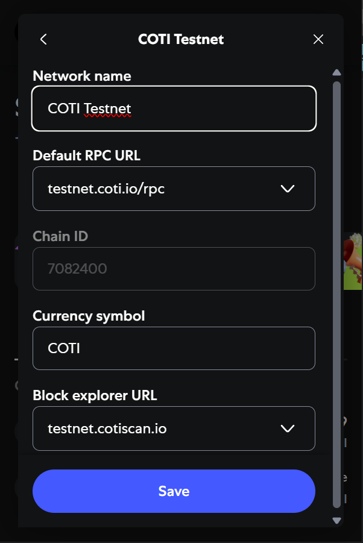

# COTI vs others

<figure><figcaption>
COTI technology compared to the competition
</figcaption></figure>

COTI V2, powered by Garbled Circuits (GC), offers unmatched capabilities in privacy-preserving computation, setting a new standard for building multi-party applications like privacy DEXs. Unlike competing technologies such as TEE, ZK-SNARK, MPC, and FHE, Garbled Circuits excel in delivering low-latency performance, compatibility across any device, and resilience through the absence of a single point of failure. With the added advantage of light storage requirements, COTI V2 ensures seamless scalability without compromising efficiency. This cutting-edge approach positions COTI V2 as the leading solution for secure, high-performance applications, driving innovation in privacy-centric blockchain technology.

### Advantages over FHE

COTI simplifies the decryption process and offers a more streamlined approach compared to traditional FHE providers. Unlike asynchronous setups that require multiple steps and callbacks, COTI enables synchronous decryption directly within smart contracts, instantly making results available for conditional checks and seamless contract execution. This simplicity not only enhances efficiency but also reduces development complexity. Furthermore, COTI strengthens privacy by securely re-encrypting decrypted data with the user’s AES key before returning it, eliminating the need for manual access control configurations. By combining ease of use with robust privacy measures, COTI delivers an unparalleled decryption experience for privacy-centric applications.

### Performance Benchmarking

COTI’s garbled circuits performed between 1,800 and 3,000 times faster than the leading FHE solution, Zama’s TFHE-rs, when [**tested**](https://medium.com/cotinetwork/coti-2-leading-the-way-in-privacy-preserving-blockchain-solutions-benchmark-study-7dac5fe18a08) for a series of basic logic operations (AND, OR, DIVIDE, etc).&#x20;

Figures for the performance of TFHE-rs are taken from [**Zama’s CPU benchmarking tests**](https://docs.zama.ai/tfhe-rs/get-started/benchmarks), which were launched on an AWS hpc7a.96xlarge instance equipped with an AMD EPYC 9R14 CPU @ 2.60GHz and 740 GB of RAM.

<figure><figcaption></figcaption></figure>

COTI’s tests timed how low long it takes to execute a series of OPCODES 1,000 times for different bit-length inputs, and were conducted on a lower-powered machine than the TFHE-rs tests to avoid unfair advantage.

<figure><figcaption></figcaption></figure>

Using this data, direct comparison for the relative performance of COTI’s garbled circuits and TFHE-rs is possible.

### Consistency Across Input Size

Performance for GCs tends to be relatively consistent, regardless of the length of the inputs. For most OPCODES, including ADD, AND, OR, EQUAL, GREATER THAN, and LESS THAN, the functions execute with a variation of roughly 10-15%, regardless of whether the input is 8, 16, 32, or 64 bits. This is largely due to the fact that network latency represents a greater delay than the execution of such small circuits.

More complex operations including MULTIPLY, DIVIDE, and REMAINDER have greater variation in execution time, but scaling is still sub-linear, so large data sets can be handled efficiently.&#x20;

This contrasts with TFHE-rs, where scaling for these operations is superlinear. For example, multiplication for 128-bit inputs takes around 2.6x longer than for 64-bit inputs, and 256 bits takes 3.3x longer than for 128.

### Efficiency Ratios

1,000 64-bit ADD operations, which is a fairly simple function, takes 49,411 μs, or 20,238 operations per second. A more complex function, such as a 64-bit MULTIPLY, still allows for 4,276 operations per second, indicating that MULTIPLY takes around 4.73x longer than ADD. The DIVIDE to ADD ratio is around 11.6.

While the performance for these complex operations is longer than for ADD, the performance ratio is still low, indicating that such operations are still executed efficiently. For comparison, the MULTIPLY to ADD ratio (64-bit) for TFHE-rs is around 2.8, while the DIVIDE to ADD ratio is 70. These ratios increase notably with greater bit length.

### Performance Comparison

GCs perform significantly faster than FHE for all benchmarked operations. Overall, COTI’s GCs are between 1,800 and 3,000 times faster than TFHE-rs.

* For 64-bit ADD, GCs require ≈49.4 μs per operation, while TFHE-rs requires 150,000 μs per operation, meaning that GCs are approximately 3,035x faster.
* For 64-bit MULTIPLY, GCs take ≈233.8 μs per operation. TFHE-rs takes 425,000 μs per operation, making GCs around 1,818x faster.
* For 64-bit GREATER THAN, GCs take ≈ 43.9 μs per operation. TFHE-rs takes 116,000 μs per operation, making GCs around 2,642x faster.

### Storage Efficiency

Storage efficiency becomes particularly important when encrypted data is held on-chain. TFHE-rs requires significant space to store ciphertexts, even after [compression](https://www.zama.ai/post/tfhe-rs-v0-7-ciphertext-compression-multi-gpu-support-and-more) (when available):

<figure><figcaption></figcaption></figure>

COTI V2’s gcEVM has a standard ciphertext size of 32 bytes, meaning that storage overheads are around 70x lower for a 64-bit input.

Together, these advantages mean that COTI’s garbled circuits can be executed on almost all devices, even lower-powered smartphones. The reduced computational requirements and storage demands allow for broader access and adoption, and an improved UX over FHE solutions.

Interested to learn more about the performance of Garbling Circuits vs. other technologies? checkout this [article](https://medium.com/cotinetwork/cotis-v2-cutting-edge-garbled-circuits-compared-to-other-privacy-preserving-smart-contracts-9e5b912612fa)
